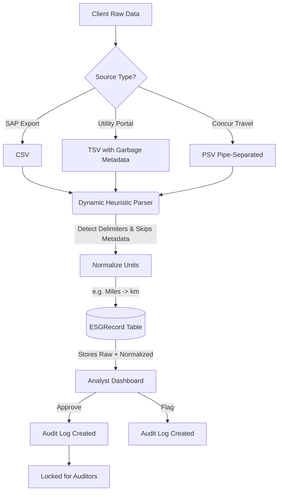

# Breathe ESG - Data Ingestion Prototype

> A full-stack prototype for ingesting, normalizing, and auditing heterogeneous ESG data sources built for Breathe ESG.

 [https://esg-frontend-ii0c.onrender.com/](https://esg-frontend-ii0c.onrender.com/)  
 [https://esg-backend-hqpz.onrender.com](https://esg-backend-hqpz.onrender.com)

## 📌 Project Overview
Breathe ESG ingests emissions and activity data from client companies, but every client’s data lives somewhere different and in a different shape. This prototype solves the problem of unstructured, messy data by providing a robust ingestion engine and an analyst review dashboard. 

The system accepts raw exports from **SAP (Fuel/Procurement)**, **Utility Portals (Electricity)**, and **Concur (Travel)**. It normalizes this messy data and surfaces it in a beautiful React dashboard where ESG analysts can review, flag, and approve records for audit.

---

## 🏗️ Architecture & Data Flow

The system is designed to handle dirty data by using a **Dynamic Heuristic Parser** that auto-detects delimiters, skips garbage metadata rows, and fuzzy-matches headers.



## ✨ Key Features
- **Dynamic File Ingestion:** Automatically detects commas, tabs, and pipes. Skips unparseable metadata rows dynamically.
- **Unit Normalization:** Converts units like "Miles" to "km" on the fly during ingestion.
- **Raw Data Lineage:** Stores the exact original JSON row alongside the normalized data so auditors can trace numbers back to the source.
- **Analyst Workflow:** Beautiful TailwindCSS dashboard to filter records by `PENDING`, `APPROVED`, or `FLAGGED` states.
- **Audit Trails:** Every status change is logged in a separate table tracking the user, timestamp, and before/after states.

## 💻 Tech Stack
- **Frontend:** React, Vite, TailwindCSS, Lucide Icons, Axios.
- **Backend:** Django, Django REST Framework.
- **Database:** PostgreSQL (Production) / SQLite (Local dev).
- **Deployment:** Render (Infrastructure as Code via `render.yaml`).

## 🚀 Running Locally

### Backend Setup
```bash
cd backend
python -m venv venv
source venv/bin/activate
pip install -r requirements.txt
python manage.py migrate
python manage.py runserver
```

### Frontend Setup
```bash
cd frontend
npm install
npm run dev
```

---
*For more deep dives into the technical choices made during this 4-day sprint, please see [`DECISIONS.md`](./DECISIONS.md), [`MODEL.md`](./MODEL.md), [`SOURCES.md`](./SOURCES.md), and [`TRADEOFFS.md`](./TRADEOFFS.md).*
